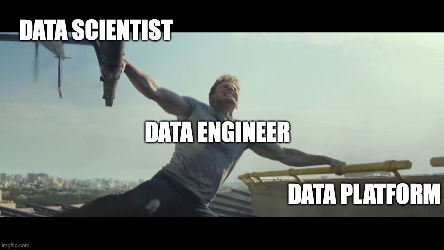

# Journal — 2025-09-20 — DATA MODELING

## 1) What I learned (bullets, not prose)
- SQL Querying - it's the known language used to generate results from the database using queries.
- Normalization is a way of safety checks. It simplifies the tables to a better understanding and faster transaction.
    * 1NF: Atomicity meaning no repeating group. 
    * 2NF: No partial dependencies
    * 3NF: No duplicate entries; issues resolved would be:
        * Update anomaly
        * Delete anomaly
- Data Modeling is how you create your database schema. This is how you organize the data in order to easily query it.
- Data Modeling Layers 
    - Conceptual
    - Logical
    - Physical

## 2) New vocabulary (define in your own words)
- **PK** : Primary key - > unique identifier; duplication of PK is not allowed.
- **FK** : Foreign key - > a reference key from another table (the bridge between tables to have relationship); it is also the primary key of the other table being linked
- **BN**: Business key - > it's a unique identifier of the business where they can easily understand it. It's not usually derived from the PK but on the business terminology used daily by the people.
- **Data Model** - > also known as database schema
- **SQL** : Structured Query Languange - > used to bring out the data from the database to answer a business question.
- **SUM AVG, MIN, MAX, COUNT, etc** - > these are set of keywords used in SQL to aggregate or group or combine or summarized data using SQL. 
- **Dimension** - > these are nouns or descriptions
- **Facts** - > these are numerical values; verbs that relates to computations and measures

## 3) Data Engineering mindset applied (what principles did I use?)
- Uniqueness and Clarity
In creating SQL queries, there should be clarity in order to provide the correct result. One should undertand the connection of each table, which tables to be used, which unique columns to use. If the tables are not correclty joined, then the result is also not correctly displayed.

Same thing with the data modeling. Before we can implement our pipelines, it should be clear enought what tables to be created, what are the primary keys for each table. Normalizing each table helps to optimze the process of generating the result and of course, updating information is easier (not sabog sabog).

## 4) Decisions & assumptions (why, alternatives, trade-offs)
- Ingesting the chinook data set. I thought all process are to be done in the DBeaver. But as I asked more clarifications, I come to undertand that what we've been doing so far with DBeaver is just a place where we do some testing and manage the data. But the real action is done through the pipelines, currently from the scripts created (I hope I understand it correctly, though). 

## 5) Open questions (things I still don’t get)
- Either Kimbal or Inmon in terms of data modeling, which one is more fluent in the world of Data Engineering? How is it better to start with mart (using Kimbal)? Is this more effective to use when the business already laid their database structures and it's hard to change it from scratch? (maybe)
- What comes first? Normalization or creating Facts and Dimensions? At what stage I need to apply the normalization and at what stage is for Facts and Dimensions?
- During the data transformation, do I need to always create the data modeling (or create the database schema)?

## 6) Next actions (small, doable steps)
- [ ] Practice more by:
    - [ ] Grab a small sample data (refer to the below links from artifacts)
    - [ ] Load it in my sandbox
    - [ ] Create my own business question to challenge my self how to answer it by creating a query.
    - [ ] Generate the query and check if it really answers the question.
    - [ ] In terms of data modeling, using the sample data, try to normalize the table and create a more appropriate application of data normalization.

## 7) Artifacts & links (code, queries, dashboards)
- Sample Datasets to practice on.
*  https://www.kaggle.com/datasets 
* https://clickhouse.com/docs/getting-started/example-datasets

---

### Mini reflection (3–5 sentences)
What surprised me? What would I do differently next time? What will I watch out for in production?

During our first DE session, I'm still figuring out what really is a pipeline and how it works. I'm trying to picture out within my imagination how data are moving. It seems to me that there's something I am missing with the process we've been doing at that point, something that I don't fully understand yet and need to confirm. All the steps been laid out yet there's a puzzle piece that I cannot figure out (yet). Until our second session (today) where more elaborated practices and explainations and revelations been shown. I practiced during my off time prior to the second session and do with from scratch - I mean from setting up the environment and running all the scripts via docker command just to see what I am missing to put to together in the picture where I can easily understand the concept. And so I came to a conclusion that pipelines are not just series of python scripts - it's the whole system that makes the data move to another place, transformed and sent to it's final place called the data warehouse. In the transform state, that's where most scripts run via DBT (just one of the tools being used for transformation). DLT is the process of loading the data from the source to the database storage (this is not yet the final DB), right now we call this raw DB. 

Hence, DLT - this is where the Extract - Load happens and we use in our practical application the database called: raw. This db raw stores all the tables being extracted from the source (eg., the MPG AUTO) and DBT - this is where we process and clean up the raw data. This is where we run the transformation.

What surprises me is that we can use single server to run all these things. A single server means a single data warehouse for all of these staging - from extraction of raw data to loading to the cleaned until it will reach the mart db. By the way, a mart db is just one of the final dbs from the database warehouse. So it's a departamentalized database just to implement security of who and what to access for specific user or department. As you know, we cannot just provide an access to everyone wiht the whole data warehouse, as to why DB marts are important to create. 

What I need to watch out for in production is perhaps to learn more about creating queries, python scripting and implementing pipelines. If a company already established their pipelines, what's in there for us to do and learn more? How will I be an effective Data Engineer in the near future? What is it that I need to focus more on? Is it Python scripting? Is it creating SQLs? Is it automation? Is it Data Modeling? Is it the tools and infrastructures? Whatever that is, one at a time I'll be able to uncover its mystery. I may not be able to master them all at once but with the right foundation, understanding, mindset and more practices, will be able to implement a reliable pipeline soon.

### BONUS: What is a meme that best describes what you feel or your learning today?

