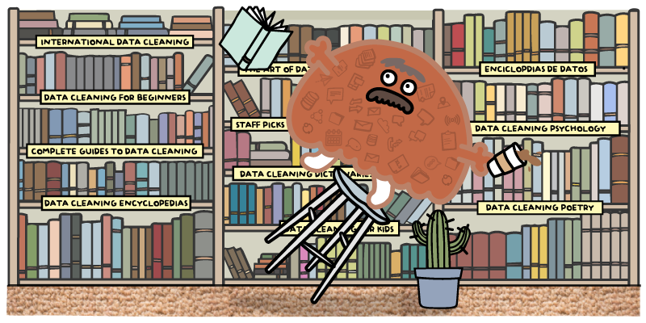

# Journal — 27 Sep 2025 — Data Modeling (part 2)

## 1) What I learned (bullets, not prose)
- Dimensional Modeling
- Data Pipeline Process: Raw -> Clean -> Mart
- Normalization 
    * is done before the ELT
    * applied for transactional databases (e.g., POS, banks)
    * use to check data quality issues 
        * examples: number of rows between raw, clean andmart or aggregated computation if the result are the same
- Star Schema
    * use when you do a report
    * used by end-users
    * always put in Mart
- Snowflake vs Star Schema
    * A star schema: 
        * joins fact to dim tables
            * fact table - numerical or computational
            * dim table - other data that describes the report
    * A Snowflake schema
        * joins dim to dim tables
        * no fact table involved

## 2) New vocabulary (define in your own words)
- **Snowflake** - a schema used for joining different dimension tables.
- **Star schema** - has 1 fact table and many dimension tables
- **Fact Table** - the center table that contains the source of truth and is being linked to different dimension tables that expands the truthfulness of the data.
- **Dimnension Table** - these are tables carrying additional information that support the main information from the fact table.

## 3) Data Engineering mindset applied (what principles did I use?)
- SST: Single Source of Truth
    * Even if it's a small dataset, as a good practice, it should be scalable and follows the standardization.

## 4) Decisions & assumptions (why, alternatives, trade-offs)
- During our normalization process with our new activity today - (OULAD data set), whenever we see a column that has repeating value, we create a new table for that column so it can be easily updated and re-used.

- This avoids duplication and makes the database easier to maintain. For example, if the course_code appears many times in the studentRegistration table, we move it into a new dim_course table. That way, if the course name or description changes, we only need to update it once.

- This also improves reusability: the same course data can be linked to student registrations, assessments, and VLE activities, instead of being copied everywhere.

- The trade-off is that queries become slightly more complex (because we now need joins), but the benefit is consistency, less storage waste, and fewer data quality issues.

## 5) Open questions (things I still don’t get)
- When to do the snowflake over star schema in production?
- What's the best practice to handle slowly changing dimensions? Is it to keep the old data and put it in an other table for history logs or you can overwrite it?
- How to roll back the data if there's a mistake during the transformation?
- What is granularity and how to apply it?
## 6) Next actions (small, doable steps)
- [ ] Create a small star schema using teh OULAD dataset
- [ ] Practice defining fact/dim tables with clear granularity

## 7) Artifacts & links (code, queries, dashboards)
- https://archive.ics.uci.edu/dataset/349/open+university+learning+analytics+dataset 

---

### Mini reflection (3–5 sentences)
What surprised me? What would I do differently next time? What will I watch out for in production?
I was surprised by how much planning is needed just to decide schema design — it’s not only about storage but also about usability and performance. If I did it again, I’d spend more time sketching schema diagrams before writing queries. In production, I’ll watch out for hidden performance bottlenecks when the dataset grows larger than test samples.
### BONUS: What is a meme that best describes what you feel or your learning today?
**When you think your schema is clean, but the data starts misbehaving** 

