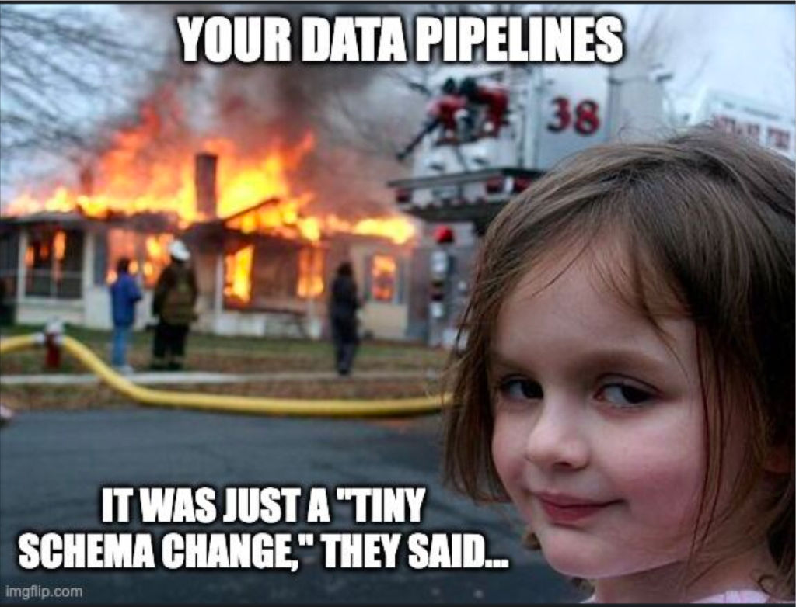

# Journal — 04 Oct 2025 — Data Quality

## 1) What I learned (bullets, not prose)
- Quality is not just accuracy, there should be trust, transparency and timeliness
- Data quality must be implemented anywhere within the pipelines.
- Data quality checks must be implemented in layered checks and must be logged for tracking.
- A data quality check must be agreed between the business and the data engineer to define what's required, what's acceptable or allowable and what's not.
- A DQ Contract or an SLA is a must as a guideline of what to implement during the quality checking.
- 5 Dimensions of Data Quality
    * Accuracy
    * Completeness
    * Reliability
    * Relevancy
    * Timeliness
- Common DQ Checks
    * Range (check that the minimum and maximum range - should be within the defined range)
    * Category
    * Freshness
    * Volume / Completenss (record count)
    * Nulls / Requiredness
    * Referential Integrity (primary and foreign keys)

## 2) New vocabulary (define in your own words)
- **SLA** — it's your evidence that the data owner agreed on something before you commence in processing the data. It's a guidline of what needs to be checked, changed, and/or deliver to the end-user. 
- **Data Qualty Check** - it’s a lifesaver for any Data Engineer. It ensures that the data you deliver to end users is accurate, reliable, and of high quality. Without this important step, the trustworthiness of your data will always be in question.
- **Orchestration** - it's related to the automation workflow of your data pipeline. As a Data Engineer, you make sure that all the correct sequence to run the data jobs are working accordingly. It's like a task scheduler. 
- **Lineage** - It's the history tracker of your data from start to finish. It helps you to audit what happened during the run time and be able to check what went wrong, why did your scheduled task stops, what cause it. So it's a list of logs where you can check for further investigation.

## 3) Data Engineering mindset applied (what principles did I use?)
- Trust but verify. Do not assume that all data passed down to you are always correct, it should be verified and be tested to avoid more issues, more wasted labor and questionable queries from the data owner. Hence, the Data Quality check step must be applied within the pipelines.

## 4) Decisions & assumptions (why, alternatives, trade-offs)
- Before today’s session, I thought the data pipelines we built in previous lessons were already complete on their own. But now that we’ve discussed Data Quality checks, it all makes more sense. Adding DQ is a big improvement—it helps catch errors early, which makes them much easier and cheaper to fix later on.

- Trade-offs: Withouht DQ checks, pipelines run fater and simpler to maintain. However, with data issues not able to check or unnoticed, until at later stage, it'll be more time consuming and costlier which results to lower confidence in your data reliability.

## 5) Open questions (things I still don’t get)
- Are there any other data quality checks aside from:
    * % tests passed (by dataset, by rule type)
    * Freshness lag (minutes/hours)
    * Volume / Baseline (Z-score)
    * Null % on critical fields
- How far should you go with data quality checks?

## 6) Next actions (small, doable steps)
- [ ] Practice in creating DQ within the pipelines especially the schema.yml

## 7) Artifacts & links (code, queries, dashboards)
- https://hub.getdbt.com/EqualExperts/dbt_unit_testing/latest/

---

### Mini reflection (3–5 sentences)
What surprised me? What would I do differently next time? What will I watch out for in production?

Being a Data Engineer is not just about building pipelines. Working with data is far from simple—it’s a big and serious responsibility. It’s not just about running pipelines; it’s about making sure every piece of data is valid, correct, reliable, and trustworthy. One small mistake—like a wrong deletion or an incorrect update—can change everything and directly impact business decisions or strategies.

That’s why, as a Data Engineer, it’s important to carefully check and validate data before it reaches the end users. Coordination and clear communication are also key to preventing any anomalies in the records being processed. Doing proper Data Quality checks helps avoid major losses in the company’s cash flow or revenue, since potential issues can be identified and fixed early. 

### BONUS: What is a meme that best describes what you feel or your learning today?

