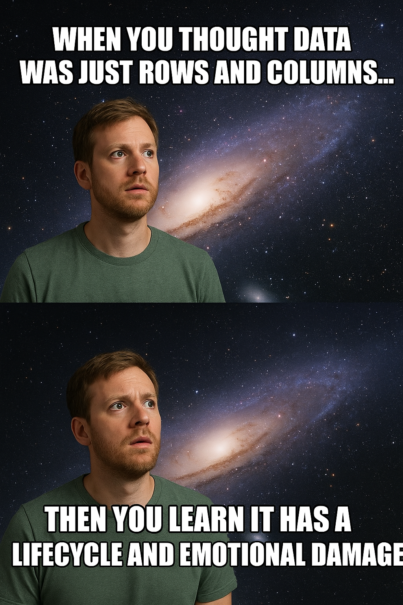

# Journal — 2025 Oct 11 - Data Collection & Web Scraping

## 1) What I learned (bullets, not prose)
- Data Lifecycle
    - Collection
    - Storage
    - Transformation
    - Serving
    - Visualization / Decision

- Data as Different Shapes
    - Tabular (Csv / Sql)
    - Hierarchical (Json / Xml)
    - Graph (Neo4j, RDF)
    - Time Series (Parquet / Influx)
    - Geospatial (GeoJson, Shapefile)

- Data Types and Semantics
    - Primitive (Integer, float, boolean, string)
    - Temporal (date, timestamp)
    - Categorical (enums, codes, labels)
    - Missing data - affects analysis

**Every column has meaning beyond its name**

- Data Formats and Storage Trade-offs
    - CSV - human-readable, but large (all texts)
    - JSON - flexible, nested
    - Parquet / ORC - columnar, compressed, efficient

**Pick formats based on use case, not convenience**

- Big Data Formats
    - Structured Data
        * example: Databse, ERP, CRM
    - Unstructured Data
        * example: Text files, images, audi, video, emails, websites, logs
    - Semi-structured Data
        * example: json, csv, xml, nosql, html

- Parquet/ORC - data format good for analytics
- When to use what:
    * Parquet - for analytics and data lakes (S3, GCS, ADLS), applicable anywhere like Spark, DuckDB, BigQuery
    * ORC - heavy Hadoop or spark shops; good for compression and stats
    * HDF5 - local modeling/prototyping, scientific arrays, single node workloads, not for distributed lakes        
- Data Ethics - just because we can collect dat, doesn't mean we should.
    * Respect privacy
    * accountability
    * Accuracy and Integrity
    * Legal compliance
    * Fairness and Bias

## 2) New vocabulary (define in your own words)
- **Web Scraping** — collection of data from any website using scripts like Python
-**CSV** - Comma Separated value, a file format for text files in tabular form where each value are separated in comma
- **API** - Application Programming Interface. The bridge to connect one application to another so it can be used by the other platform or application.
- **Pandas** - a Python library which is fast, powerful, flexible and easy to use open source data analysis and manipulation tool. Widely used to read and write flat file data into tabular form.
- **Ibis** a dataframe library used to connect databases so then it can be used to any application or data system for further analysis.
- **Endpoint** - it's the URL where you send requests to grab or post data. 
- **HTTP** - Hypertext Transfer Protocol - website
- **HTML** - HyperText Markup Language - structure and content of a web page
- **BeautifulSoup** - a Python library that is used for scraping web pages especially static web pages
- **Headless Browser** - no browser interface is shown while scraping the data, using libraries like playright or chromium which mimics the actual browser. 

## 3) Data Engineering mindset applied (what principles did I use?)
- Understanding, Collecting and Using Data Responsibly
- Scrape responsibly. Not because data is available, you can scrape and use it anytime you want. 

## 4) Decisions & assumptions (why, alternatives, trade-offs)
- Decision: Store scraped data as CSV files during experimentation.
- Assumption: CSV is easy to read and compatible with most tools.
- Trade-off: CSVs are not efficient for large-scale analytics; switching to Parquet or a database later will be necessary.

## 5) Open questions (things I still don’t get)
- How do I handle dynamic content that only appears after user interaction (scroll, click, etc.)?
- How can I automatically detect schema changes or data drift in scraped sources?
- How to scraping jobs and ensure reliability at scale?

## 6) Next actions (small, doable steps)
- [ ] Build a small web scraping script using BeautifulSoup to extract product or article data.
- [ ] Save the output in both CSV and Parquet to compare usability and size.
- [ ] Try scraping a dynamic page using Playwright or Selenium to experience the difference.
- [ ] Set up a basic logging mechanism (timestamp, source, status) to track scraping runs.

## 7) Artifacts & links (code, queries, dashboards)
- https://github.com/ogbinar/ftw-python-ingestion

---

### Mini reflection (3–5 sentences)
What surprised me? What would I do differently next time? What will I watch out for in production?

When I started learning about data, I thought I already had a pretty good understanding of it. Numbers, tables, reports — that was “data” to me. But as I dove deeper, I realized that what I knew was only the tip of the iceberg.

What truly surprised me was discovering that data has its own lifecycle — it’s born, it grows, it changes shape, and it even becomes obsolete. Data doesn’t just sit in databases; it flows through systems, transforms, and tells stories if you know how to listen.

The more I explore, the more fascinated I become. Data isn’t just a technical concept — it’s part of everything we do. Businesses rely on it to make smarter decisions, and we, as individuals, make daily choices based on the data we see and interpret. Even our surroundings are filled with data, waiting to be collected and understood.

At the end of the day, we can’t escape data — it’s everywhere. What matters is how we ingest, transform, and translate it into something meaningful, something that helps us make sense of the world.

### BONUS: What is a meme that best describes what you feel or your learning today?
**When you thought data was just rows and columns… then you learn it has a lifecycle and emotional damage.**

